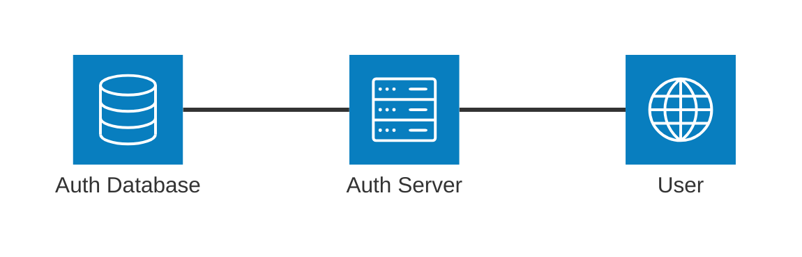
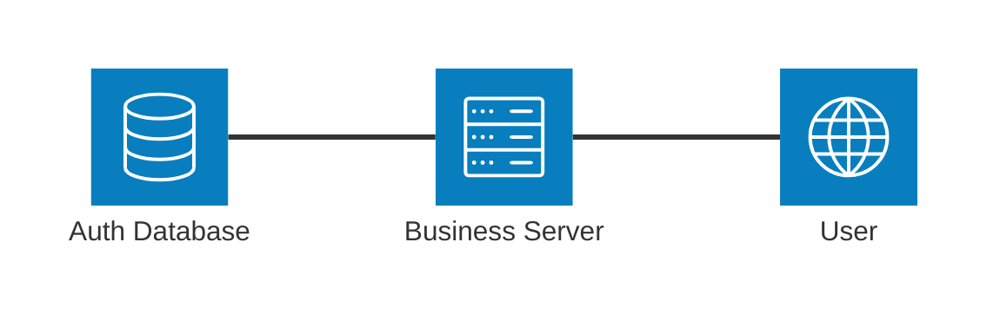

# Simple Auth

Simple Auth 是一个**单独部署的**的用户、会话系统。

部署: `Deno Deploy`, `PostgreSQL`

单独部署，即独立于业务系统。业务系统可能是用 Java 写的，部署在阿里云的服务器上，而 Simple Auth 是用 typescript 写的，可以部署在腾讯云的服务器上。

用户可通过邮箱、OAuth 验证身份。支持多种 OAuth provider，如 GitHub、Google。

不区分登录和注册，“第一次登录”视为注册。

同一时间，邮箱验证码只能是“登录”或“绑定”之一种。验证码有效时间是 2 分钟，重复发送间隔是 1 分钟。

## 架构

#### 注册 & 登录

#### 会话

## FAQ

##### 为什么是“单独可部署的微服务”而不是“SDK”

+ auth 系统与业务系统解耦，不用考虑业务系统的技术栈，不论是 Nodejs，Java，Python，IOS App……
+ 使业务系统更简洁（代码、数据库都更简洁）
+ 多个业务系统可共享同一个 auth 系统
+ auth 系统可以单独迭代升级（不重要的业务系统可以比较随意）

##### 为什么登录走 http，而会话直接读 pgsql

+ 直接读 pqsql 比较快
